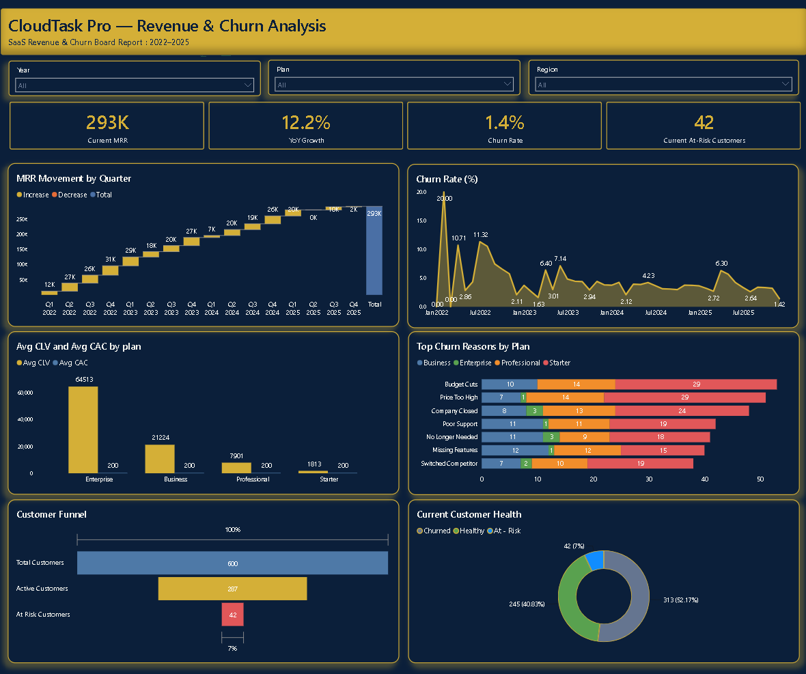
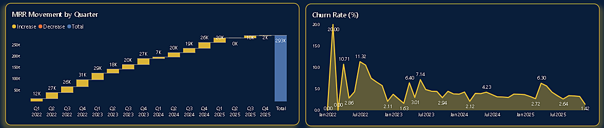
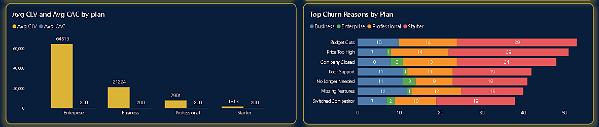
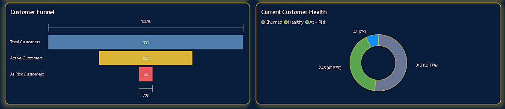

# ☁️ CloudTask Pro: SaaS Revenue & Churn Analysis Dashboard

 
*The complete executive dashboard, built in Power BI Desktop.*

## 📊 Project Overview

This project is an executive dashboard built for CloudTask Pro, a B2B SaaS company selling project management software. The company has grown to 600 customers since 2022, but the leadership board was concerned about high customer churn.

The goal was to analyze subscription data, Monthly Recurring Revenue (MRR), and customer behavior to answer the board's biggest questions: Is churn getting worse? Who is churning and why? Are we making money? And who is at risk of leaving next?

##  Dashboard Walkthrough (Visual Guide)

Since GitHub can't display an interactive Power BI file directly, here's a visual walkthrough of each section and what it tells the business.

### 1. The Executive Control Panel

At the top:  four KPI cards giving an instant read on the business — **Current MRR (293K)**, **YoY Growth (12.2%)**, **Current Churn Rate (1.4%)**, and **At-Risk Customers (42)**.

### 2. Revenue Trends & Churn Story

**Left (Waterfall):** shows the "leaky bucket" effect — how MRR moves quarter by quarter as new revenue comes in and churned revenue drains out, building up to the current total. Hovering over any bar reveals the Net Revenue Retention figure for that quarter in the tooltip.

**Right (Line chart):** tracks the monthly churn rate across the full 4-year history. The story is clear: churn peaked at 20% in early 2022 and has steadily declined to 1.4% by the end of 2025 — well under the 4% target the CFO set.

### 3. Unit Economics & Churn Drivers

**Left (Column chart):** compares Average Customer Lifetime Value (CLV) against a blended Customer Acquisition Cost (CAC) of **$200** across all four plans. Every plan is profitable — Enterprise most dramatically at roughly $65K CLV, all the way down to Starter at a still-healthy ~$1,800.

**Right (Stacked bar):** ranks the top reasons customers leave, color-coded by plan. Starter customers (red) dominate almost every reason category, especially "Price Too High" and "Budget Cuts" — while Enterprise and Business churn is comparatively rare and mostly tied to companies closing rather than dissatisfaction.

### 4. Customer Base & Health Tracking

**Left (Funnel):** shows the full customer base narrowing from 600 Total Customers → 287 Active → 42 At-Risk.

**Right (Donut):** the same 600 customers broken into Churned (52%) / Healthy (41%) / At-Risk (7%) segments at a glance. At-risk customers are flagged using a feature-usage threshold below 30% — this chart gives Customer Success their exact outreach list for the day.

## 🛠️ Tech Stack & DAX Highlights

- **Power BI Desktop** — data modeling, DAX, and visualization
- **Power Query** — cleaned data types (converted a percentage column stored as whole numbers into true decimals so formatting displayed correctly, and confirmed date columns were properly typed for the Date table relationship and slicers)
- **DAX modeling** — built quarter-over-quarter revenue measures using explicit date-math (`EDATE`) rather than relying on relationship-dependent time intelligence functions, which avoided a subtle bug where a naive approach silently returned incorrect period comparisons; also built the churn, at-risk, and CLV logic from row-level customer data
